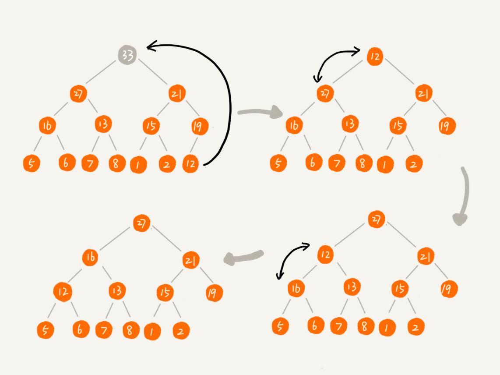

# 堆和堆排列

## <font color = blue>内容概要</font>

1. 如何理解堆
2. 堆排序方式

## <font color = blue>遗留问题</font>

1. 为什么说堆排序没有快速排序快？
2. 


### 堆（Heap）

+ 堆的特征

  + 堆，一种特殊的树。
  + 堆这种数据结构的应用场景非常多，最经典的莫过于堆排序了。堆排序是一种原地的、时间复杂度为 $O(nlogn)$ 的排序算法。
  + 前面学过快速排序，平均情况下，它的时间复杂度为$ O(nlogn)$。尽管这两种排序算法的时间复杂度都是 相同，甚至堆排序比快速排序的时间复杂度还要稳定，但是，在实际的软件开发中，快速排序的性能要比堆排序好。

+ 如何理解堆

  + 只要满足下面两点，它就是一个堆

    + 堆是一个完全二叉树
    + 堆中每一个节点的值都必须大于等于（或小于等于）其子树中每个节点的值

  + 第一点，堆必须是一个完全二叉树。完全二叉树要求，除了最后一层，其他层的节点个数都是满的，最后一层的节点都靠左排列。

  + 第二点，堆中的每个节点的值必须大于等于（或者小于等于）其子树中每个节点的值。实际上，还可以换一种说法，堆中每个节点的值都大于等于（或者小于等于）其左右子节点的值。这两种表述是等价的。对于每个节点的值都大于等于子树中每个节点值的堆，我们叫作**“大顶堆”**。对于每个节点的值都小于等于子树中每个节点值的堆，我们叫作**“小顶堆”**。

  + 下图中第 1 个和第 2 个是大顶堆，第 3 个是小顶堆，第 4 个不是堆。除此之外，从图中还可以看出来，对于同一组数据，我们可以构建多种不同形态的堆。

    

+ 如何存储一个堆

  + 完全二叉树比较适合用数组来存储。用数组来存储完全二叉树是非常节省存储空间的。因为不需要存储左右子节点的指针，单纯地通过数组的下标，就可以找到一个节点的左右子节点和父节点。

  + 一个用数组存储堆的例子

    从图中我们可以看到，数组中下标为 i 的节点的左子节点，就是下标为 i∗2 的节点，右子节点就是下标为 i∗2+1 的节点，父节点就是下标为 i/2 的节点。

    

+ 堆的操作

  + 往堆中插入一个元素

    + 往堆中插入一个元素后，需要继续满足堆的两个特性。

    + 如果把新插入的元素放到堆的最后，不符合堆的特性。于是，就需要进行调整，让其重新满足堆的特性，这个过程就叫作**堆化（heapify）**。堆化实际上有两种，从下往上和从上往下。

      

    + 堆化非常简单，就是顺着节点所在的路径，向上或者向下，对比，然后交换。

    + 堆化的过程分解图。可以让新插入的节点与父节点对比大小。如果不满足子节点小于等于父节点的大小关系，就互换两个节点。一直重复这个过程，直到父子节点之间满足刚说的那种大小关系。

      

      ```java
      public class Heap {
        private int[] a; // 数组，从下标1开始存储数据
        private int n;  // 堆可以存储的最大数据个数
        private int count; // 堆中已经存储的数据个数
      
        public Heap(int capacity) {
          a = new int[capacity + 1];
          n = capacity;
          count = 0;
        }
      
        public void insert(int data) {
          if (count >= n) return; // 堆满了
          ++count;
          a[count] = data;
          int i = count;
          while (i/2 > 0 && a[i] > a[i/2]) { // 自下往上堆化
            swap(a, i, i/2); // swap()函数作用：交换下标为i和i/2的两个元素
            i = i/2;
          }
        }
       }
      ```

  + 删除堆顶元素

    + 从堆的定义的第二条中，任何节点的值都大于等于（或小于等于）子树节点的值，可以发现，堆顶元素存储的就是堆中数据的最大值或者最小值。

    + 假设构造的是大顶堆，堆顶元素就是最大的元素。当我们删除堆顶元素之后，就需要把第二大的元素放到堆顶，那第二大元素肯定会出现在左右子节点中。然后我们再迭代地删除第二大节点，以此类推，直到叶子节点被删除。

    + 分解图如下。不过这种方法有点问题，就是最后堆化出来的堆并不满足完全二叉树的特性。

      

    + 实际上，稍微改变一下思路，就可以解决这个问题。下面这幅图，把最后一个节点放到堆顶，然后利用同样的父子节点对比方法。对于不满足父子节点大小关系的，互换两个节点，并且重复进行这个过程，直到父子节点之间满足大小关系为止。**这就是从上往下的堆化方法**。

    + 因为移除的是数组中的最后一个元素，而在堆化的过程中，都是交换操作，不会出现数组中的“空洞”，所以这种方法堆化之后的结果，肯定满足完全二叉树的特性。

      

      ```java
      public void removeMax() {
        if (count == 0) return -1; // 堆中没有数据
        a[1] = a[count];
        --count;
        heapify(a, count, 1);
      }
      
      private void heapify(int[] a, int n, int i) { // 自上往下堆化
        while (true) {
          int maxPos = i;
          if (i*2 <= n && a[i] < a[i*2]) maxPos = i*2;
          if (i*2+1 <= n && a[maxPos] < a[i*2+1]) maxPos = i*2+1;
          if (maxPos == i) break;
          swap(a, i, maxPos);
          i = maxPos;
        }
      }
      ```

  + 时间复杂度分析

    + 一个包含 n 个节点的完全二叉树，树的高度不会超过$ log_2n$。堆化的过程是顺着节点所在路径比较交换的，所以堆化的时间复杂度跟树的高度成正比，也就是$O(logn)$。
    + 插入数据和删除堆顶元素的主要逻辑就是堆化，所以，往堆中插入一个元素和删除堆顶元素的时间复杂度都是 $O(logn)$。


### 如何基于堆实现排序

+ 借助于堆这种数据结构实现的排序算法，就叫作堆排序。这种排序方法的时间复杂度非常稳定，是 $O(nlogn)$，并且它还是原地排序算法。

+ 堆排序的过程大致分解成两个大的步骤，**建堆**和**排序**

+ 建堆

  + 首先将数组原地建成一个堆。所谓“原地”就是，不借助另一个数组，就在原数组上操作。建堆的过程，有两种思路。

    + 第一种是借助前面讲的，在堆中插入一个元素的思路。尽管数组中包含 n 个数据，但是可以假设，起初堆中只包含一个数据，就是下标为 1 的数据。然后，调用前面讲的插入操作，将下标从 2 到 n 的数据依次插入到堆中。这样我们就将包含 n 个数据的数组，组织成了堆。

    + 第二种实现思路，跟第一种截然相反。第一种建堆思路的处理过程是从前往后处理数组数据，并且每个数据插入堆中时，都是从下往上堆化。而第二种实现思路，是从后往前处理数组，并且每个数据都是从上往下堆化。举例如下，画了一个第二种实现思路的建堆分解步骤图。因为叶子节点往下堆化只能自己跟自己比较，所以可以直接从第一个非叶子节点开始，依次堆化就行了。

      

      

      ```java
      
      private static void buildHeap(int[] a, int n) {
        for (int i = n/2; i >= 1; --i) {
          heapify(a, n, i);
        }
      }
      
      private static void heapify(int[] a, int n, int i) {
        while (true) {
          int maxPos = i;
          if (i*2 <= n && a[i] < a[i*2]) maxPos = i*2;
          if (i*2+1 <= n && a[maxPos] < a[i*2+1]) maxPos = i*2+1;
          if (maxPos == i) break;
          swap(a, i, maxPos);
          i = maxPos;
        }
      }
      ```

    + 在这段代码中，对下标从 n/2 开始到 1 的数据进行堆化，下标是 n/2+1 到 n 的节点是叶子节点，不需要堆化。实际上，对于完全二叉树来说，下标从 n/2+1 到 n 的节点都是叶子节点

  + 时间复杂度分析

    + 

+ 排序