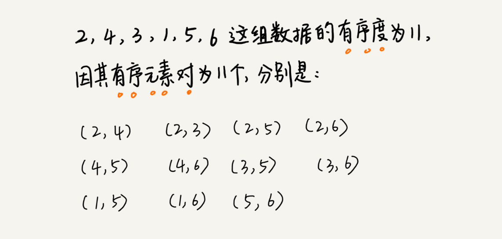
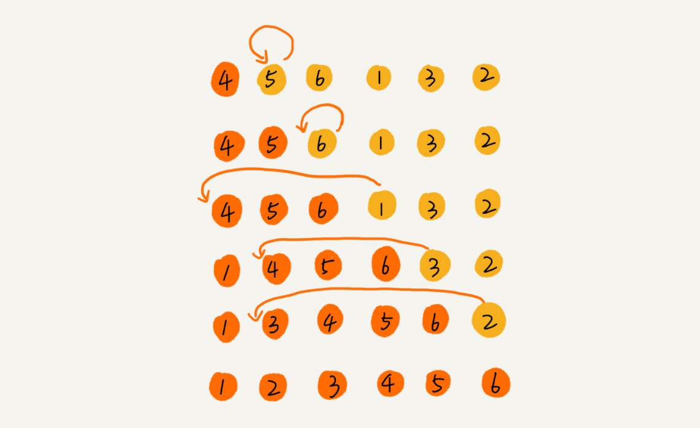

# 排序上

##  <font color = blue> 内容概要</font>

1. 常见的排序方法，及其时间复杂度分析
2. 分析算法的角度
3. 冒泡排序，插入排序，选择排序比较

## <font color = blue>遗留问题</font>

1. 如何理解稳定的排序算法？
2. 理解插入算法的思想
3. 三种基本排序实现？
4. 插入排序的优化希尔排序怎么理解？
5. 如果数据存储在链表中，这三种排序算法还能工作吗？如果能，那相应的时间、空间复杂度又是多少？


### 排序分类

+ 最经典的、最常用的：冒泡排序、插入排序、选择排序、归并排序、快速排序、计数排序、基数排序、桶排序

+ 按照时间复杂度把它们分成了三类：

  

+ 基于比较的排序算法：冒泡、插入、选择、快排、归并

+ 评价、分析一个排序算法角度

  + 排序算法的执行效率

    + 最好情况、最坏情况、平均情况时间复杂度
    + 考虑时间复杂度的系数、常数 、低阶
    + 比较次数和交换（或移动）次数

  + 排序算法的内存消耗

    + **原地排序**（Sorted in place）算法，特指空间复杂度是 O(1) 的排序算法。冒泡、插入、选择都是原地排序算法。

  + 排序算法的稳定性

    + 稳定性：如果待排序的序列中存在值相等的元素，经过排序之后，相等元素之间原有的先后顺序不变

    + 经过某种排序算法排序之后，如果两个相同元素的前后顺序没有改变，这种排序算法叫作**稳定的排序算法**；如果前后顺序发生变化，那对应的排序算法就叫作**不稳定的排序算法**。

    + 要给电商交易系统中的“订单”排序。订单有两个属性，一个是下单时间，另一个是订单金额。希望按照金额从小到大对订单数据排序。对于金额相同的订单，我们希望按照下单时间从早到晚有序排列。**稳定排序算法可以保持金额相同的两个对象，在排序之后的前后顺序不变**。第一次排序，所有的订单按照下单时间从早到晚有序排列。在第二次排序中，用稳定的排序算法后，相同金额的订单仍然保持下单时间从早到晚有序。

      

    

### 冒泡排序（Bubble Sort）

+ 冒泡排序只会操作相邻的两个数据。每次冒泡操作都会对相邻的两个元素进行比较，看是否满足大小关系要求。如果不满足就让它俩互换。一次冒泡会让至少一个元素移动到它应该在的位置，重复 n 次，就完成了 n 个数据的排序工作。

+ 对一组数据 4，5，6，3，2，1，从小到大进行排序，第一次冒泡操作的详细过程：

  

+ 要想完成所有数据的排序，要进行 6 次这样的冒泡操作

  

+ 当某次冒泡操作已经没有数据交换时，说明已经达到完全有序，不用再继续执行后续的冒泡操作。这里面给 6 个元素排序，只需要 4 次冒泡操作就可以了.

  

+ 冒泡排序算法的原理代码示意：

  ```java
  // 冒泡排序，a表示数组，n表示数组大小
  public void bubbleSort(int[] a, int n) {
  	if (n <= 1) return;
   
  	for (int i = 0; i < n; ++i) {
      // 提前退出冒泡循环的标志位
  		boolean flag = false;
     		for (int j = 0; j < n - i - 1; ++j) {
      		if (a[j] > a[j+1]) { // 交换
          		int tmp = a[j];
          		a[j] = a[j+1];
          		a[j+1] = tmp;
          		flag = true;  // 表示有数据交换      
          	}
      	}
      	if (!flag) break;  // 没有数据交换，提前退出
      }
  }
  ```

+ 冒泡算法分析：

  + 冒泡的过程只涉及相邻数据的交换操作，只需要常量级的临时空间，所以它的空间复杂度为 O(1)，是一个原地排序算法。

  + 在冒泡排序中，只有交换才可以改变两个元素的前后顺序。为了保证冒泡排序算法的稳定性，当有相邻的两个元素大小相等的时候，我们不做交换，相同大小的数据在排序前后不会改变顺序，所以冒泡排序是稳定的排序算法。

  + 最好情况下，要排序的数据已经是有序的了，只需要进行一次冒泡操作，就可以结束了，所以最好情况时间复杂度是 $O(n)$。而最坏的情况是，要排序的数据刚好是倒序排列的，需要进行 n 次冒泡操作，所以最坏情况时间复杂度为 $O(n^2)$。

    

+ 平均情况下的时间复杂度分析：

  + **有序度**是数组中具有有序关系的元素对的个数。**逆序度**的定义正好跟有序度相反（默认从小到大为有序）。

    ```
    有序元素对：a[i] <= a[j], 如果i < j。
    
    逆序元素对：a[i] > a[j], 如果i < j。
    ```

    

    + 对于一个倒序排列的数组，比如 6，5，4，3，2，1，有序度是 0。对于一个完全有序的数组，比如 1，2，3，4，5，6，有序度就是 **n*(n-1)/2**，也就是 15。这种完全有序的数组的有序度叫作**满有序度**。

    + **逆序度 = 满有序度 - 有序度**。我们排序的过程就是一种增加有序度，减少逆序度的过程，最后达到满有序度，就说明排序完成了。
    + 冒泡排序包含两个操作原子，**比较**和**交换**。每交换一次，有序度就加 1。不管算法怎么改进，**交换次数总是确定的，即为初始逆序度**，也就是**n*(n-1)/2 – 初始有序度**。**注意交换次数不是冒泡次数**。
    + 

  + 对于包含 n 个数据的数组进行冒泡排序，平均交换次数是多少呢？

    + 最坏情况下，初始状态的有序度是` 0`，所以要进行` n*(n-1)/2` 次交换。
    + 最好情况下，初始状态的有序度是` n*(n-1)/2`，就不需要进行交换。
    + 可以取个中间值` n*(n-1)/4`，来表示初始有序度既不是很高也不是很低的平均情况。
    + 换句话说，平均情况下，需要` n*(n-1)/4` 次交换操作，比较操作肯定要比交换操作多，而复杂度的上限是$ O(n^2)$，所以平均情况下的时间复杂度就是 $O(n^2)$。
    + 这个平均时间复杂度推导过程其实并不严格，但是很多时候很实用，毕竟概率论的定量分析太复杂，不太好用。到快排的时候，还会再次用这种“不严格”的方法来分析平均时间复杂度。


### 插入排序（Insertion Sort）  

+ 一个有序的数组，我们往里面添加一个新的数据后，如何继续保持数据有序呢？很简单，我们只要遍历数组，找到数据应该插入的位置将其插入即可。

  

+ 这是一个动态排序的过程，即动态地往有序集合中添加数据，我们可以通过这种方法保持集合中的数据一直有序。而对于一组静态数据，也可以借鉴上面讲的插入方法，来进行排序，于是就有了插入排序算法。

+ 算法思路

  + 首先，将数组中的数据分为两个区间，**已排序区间**和**未排序区间**。

  + 初始已排序区间只有一个元素，就是数组的第一个元素。

  + 插入算法的核心思想是取未排序区间中的元素，在已排序区间中找到合适的插入位置将其插入，并保证已排序区间数据一直有序。

  + 重复这个过程，直到未排序区间中元素为空，算法结束。

    

    ```java
    // 插入排序，a表示数组，n表示数组大小
    public void insertionSort(int[] a, int n) {
    	if (n <= 1) return;
    	for (int i = 1; i < n; ++i) {
        	int value = a[i];
        	int j = i - 1;
        	// 查找插入的位置
        	for (; j >= 0; --j) {
          		if (a[j] > value) {
            		a[j+1] = a[j];  // 数据移动
          		} else {
            		break;
          		}
       		 }
        	a[j+1] = value; // 插入数据
     	 }
    }
    ```
  
+ 操作次数

  + 插入排序也包含两种操作，一种是**元素的比较**，一种是**元素的移动**。

  + 当我们需要将一个数据 a 插入到已排序区间时，需要拿 a 与已排序区间的元素依次比较大小，找到合适的插入位置。

  + 找到插入点之后，我们还需要将插入点之后的元素顺序往后移动一位，这样才能腾出位置给元素 a 插入。

  + 对于不同的查找插入点方法（从头到尾、从尾到头），元素的比较次数是有区别的。**但对于一个给定的初始序列，移动操作的次数总是固定的，就等于初始逆序度**。

  + 为什么说移动次数就等于逆序度呢？如下图所示，满有序度是 n*(n-1)/2=15，初始序列的有序度是 5，所以初始逆序度是 10。插入排序中，数据移动的个数总和也等于 10=3+3+4。

    


+ 算法分析

  + 从实现过程可以很明显地看出，插入排序算法的运行并不需要额外的存储空间，所以空间复杂度是 O(1)，也就是说，这是一个原地排序算法。

  + 在插入排序中，对于值相同的元素，我们可以选择将后面出现的元素，插入到前面出现元素的后面，这样就可以保持原有的前后顺序不变，所以插入排序是稳定的排序算法。

  + 时间复杂度分析：

    + 如果要排序的数据已经是有序的，我们并不需要搬移任何数据。
  + 如果我们从尾到头在有序数据组里面查找插入位置，每次只需要比较一个数据就能确定插入的位置。所以这种情况下，最好是时间复杂度为 O(n)。**注意，这里是从尾到头遍历已经有序的数据**。
    + 如果数组是倒序的，每次插入都相当于在数组的第一个位置插入新的数据，所以需要移动大量的数据，所以最坏情况时间复杂度为 $O(n^2)$。还记得我们在数组中插入一个数据的平均时间复杂度是多少吗？没错，是 O(n)。所以，对于插入排序来说，每次插入操作都相当于在数组中插入一个数据，循环执行 n 次插入操作，所以平均时间复杂度为 $O(n^2)$。

    

### 选择排序（Selection Sort）

+ 选择排序算法的实现思路有点类似插入排序，也分已排序区间和未排序区间。但是选择排序每次会从未排序区间中找到最小的元素，将其放到已排序区间的末尾。

  

+ 算法分析
  + 选择排序空间复杂度为 O(1)，是一种原地排序算法。选择排序的最好情况时间复杂度、最坏情况和平均情况时间复杂度都为 $O(n^2)$。
  + 选择排序是一种不稳定的排序算法。从前面画的那张图中，可以看出，选择排序每次都要找剩余未排序元素中的最小值，并和前面的元素交换位置，这样破坏了稳定性。比如 5，8，5，2，9 这样一组数据，使用选择排序算法来排序的话，第一次找到最小元素 2，与第一个 5 交换位置，那第一个 5 和中间的 5 顺序就变了，所以就不稳定了。正是因此，相对于冒泡排序和插入排序，选择排序就稍微逊色了。


### 为什么插入排序要比冒泡排序更受欢迎

+ 冒泡排序和插入排序的时间复杂度都是$ O(n^2)$，都是原地排序算法，为什么插入排序要比冒泡排序更受欢迎呢？

+ 冒泡排序不管怎么优化，元素交换的次数是一个固定值，是原始数据的逆序度。插入排序是同样的，不管怎么优化，元素移动的次数也等于原始数据的逆序度。

+ 但是，从代码实现上来看，冒泡排序的数据交换要比插入排序的数据移动要复杂，冒泡排序需要 3 个赋值操作，而插入排序只需要 1 个。

  ```c
  //冒泡排序中数据的交换操作：
  if (a[j] > a[j+1]) { // 交换
     int tmp = a[j];
     a[j] = a[j+1];
     a[j+1] = tmp;
     flag = true;
  }
  
  //插入排序中数据的移动操作：
  if (a[j] > value) {
    a[j+1] = a[j];  // 数据移动
  } else {
    break;
  }
  ```

  

+ 我们把执行一个赋值语句的时间粗略地计为单位时间（unit_time），然后分别用冒泡排序和插入排序对同一个逆序度是 K 的数组进行排序。
+ 用冒泡排序，需要 K 次交换操作，每次需要 3 个赋值语句，所以交换操作总耗时就是 3*K 单位时间。而插入排序中数据移动操作只需要 K 个单位时间。


### 内容小结

+ 从执行效率、内存消耗和稳定性三个方面分析比较

  

+ 分析比较
  + 这三种时间复杂度为$ O(n^2)$ 的排序算法中，冒泡排序、选择排序，可能就纯粹停留在理论的层面了，学习的目的也只是为了开拓思维，实际开发中应用并不多，但是**插入排序还是挺有用的**。
  + 排序优化的时候，有些编程语言中的排序函数的实现原理会用到插入排序算法。
  + 这三种排序算法，实现代码都非常简单，对于小规模数据的排序，用起来非常高效。但是在大规模数据排序的时候，这个时间复杂度还是稍微有点高。